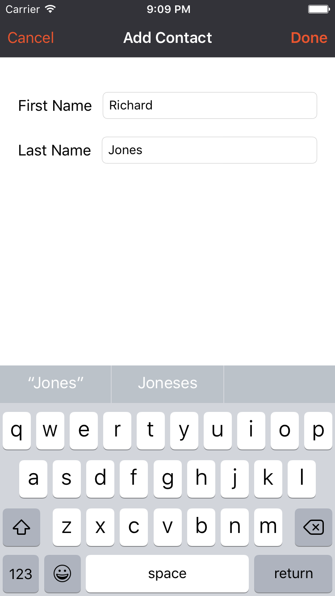

---

**TL;DR**: A well designed architecture is important to keep a project maintainable in the long term. In this article, we'll compare MVVM and VIPER for iOS projects as an alternative to the traditional MVC.

---

[MVC](https://en.wikipedia.org/wiki/Model–view–controller) is a well-known concept for those who have been developing software for a reasonable length of time. It's an acronym for **Model View Controller**, meaning that your project will be divided in 3 parts: _Model_, representing the entities; _View_, representing the interface with which the user interacts; and _Controller_, responsible for connecting the other two pieces. That's how Apple recomends us to organize our iOS projects - which means that everything that is not a View or Model is part of the Controller layer.

However, you problably know that projects can be highly complex: handling network requests, parsing responses, accessing data models, formatting data for the interface, responding to interface events, and so on. You'll end up with enormous Controllers, responsible for all these different things and not reusable at all. In other words, MVC is a nightmare for developers in charge of the maintenance of a project. But how can we accomplish a better separation of concerns and reusability for iOS projects?

We'll explore two popular alternatives for MVC: MVVM and VIPER. Both are gaining popularity in the iOS community, and proved to be good ways to go instead of the traditional MVC (gently nicknamed as [Massive View Controller](https://twitter.com/Colin_Campbell/status/293167951132098560)). We'll talk about how these two different architectures are structured, build an example application and compare when it's the case to use one or the other.

## MVVM with example

### How it works

MVVM stands for **Model-View-ViewModel**. It's a different way to arrange responsibilities, changing a few roles compared to MVC.

1. **Model** - This is the layer that does not change if compared to MVC. It still represents the data-model layer of your application, and can hold business logic responsibilities as well. You may also want to create a manager class to manipulate the model objects.

2. **View** - Here things start to change. The _View_ layer in MVVM englobes the interface (UIView subclasses, xib and storyboard files), the view logic (animations, drawing) and handling user input events (button clicks, transitions, etc). Those are responsibilities of the _View_ and the _Controller_ in the MVC. This means that your views will remain the same, while your controllers will only contain a small subset of the responsibilities they have in MVC - and will get reasonably smaller than usual

3. **ViewModel** - That's the new home for most of your usual Controller code. _ViewModel_ will request the data from the model layer (it might be a local access to a database or a network request) and pass it back to the view, formatted in the way it will be displayed. But it's a two-way mechanism: user input, when necessary, will also get through the ViewModel to update the Model. It's also interesting to create a separated network manager class to handle requests and data parsing.

Comparing to MVC, you change from a architecture that looks like this:

// image

For something that looks like this:

// image

Now it's time to get hands dirty to grasp the new concepts. So let's build an example app structured using MVVM!

### MVVM Contacts App

We'll build a Contacts app. You can follow the example in the _MVVM Contacts Starter_ folder in [this repository](https://github.com/auth0-tutorials/mvvm_viper/).

The app has two screens: the first is a list of contacts, displayed in table view with their full name and a placeholder profile image.


The second is an Add Contact screen, with first/last name text fields and cancel/done button items.



#### Model

The following code is a struct to represent the contact and a few operator overloading functions. Put it in the **Contact** file.

```swift
public struct Contact {
    var firstName = ""
    var lastName = ""

    var fullName: String {
        get {
            return "\(firstName) \(lastName)"
        }
    }
}

public func <(lhs: Contact, rhs: Contact) -> Bool {
    return lhs.fullName.lowercaseString < rhs.fullName.lowercaseString
}

public func >(lhs: Contact, rhs: Contact) -> Bool {
    return lhs.fullName.lowercaseString > rhs.fullName.lowercaseString
}
```

## VIPER with example

### How it works

VIPER is an application of the [Clean Architecture](https://8thlight.com/blog/uncle-bob/2012/08/13/the-clean-architecture.html) to iOS projects. It stands for View, Interactor, Presenter, Entity, and Router. It's a really segmented way to divide responsibilities, fits very well with unit testing and makes your code more reusable. 

// image

1. View - It's the interface layer, which means UIKit files (including UIViewController). At this point, it's quite clear that UIViewController subclasses should belong to the View layer in a more decoupled architecture. In VIPER, things are basically the same of those in MVVM: views are responsible for displaying what the presenter asks them to, and to transmit user input back to the Presenter.

2. Interactor - Contains the business logic that are described by the use cases in the application. Similar to the ViewModel, the interactor is responsible for fetching data from the model layer (using network or local database), and its implementation is totally independent of the UI. It's important to remember that network and database managers are not part of VIPER, so they are treated as separated dependencies.

3. Presenter - Contains view logic to format data to be displayed. In MVVM, this is part of the job done by the ViewModel. The Presenter receives data from the Interactor and carry it to the View. Also, it reacts to user inputs, asking for more data or sending it back to the Interactor.

4. Entity - Has the responsibilities of the Model layer in the other architectures. Entities are plain data objects, managed by the Interactor.

5. Router - The navigation logic of the application. It might not seem an important layer, but if you have to reuse the same iPhone views in a iPad, the only thing that might change is the way that the views are presented. This lets your other layers untouched, and the Router is responsible for the navigation flow in each situation.

Comparing to MVX styles, Viper has a few key differences in the distribution of responsibilities:
- It introduces Router, the layer responsible for the navigation flow.
- Entities are plain data structures, transferring the access logic that usually belongs to Model to the Interactor.
- ViewModel (and Controller in MVC) responsibilities are shared among Interactor and Presenter.

Again, it's time to get the hands dirty and explore the VIPER architecture with an example app.

### Search app
