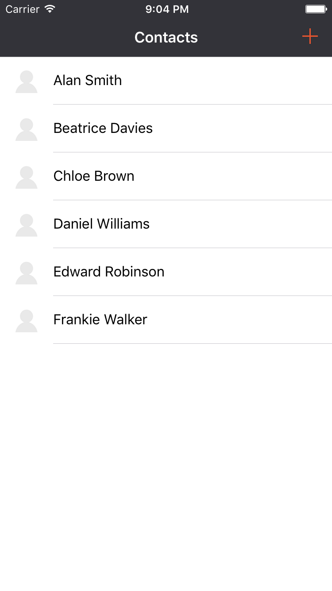
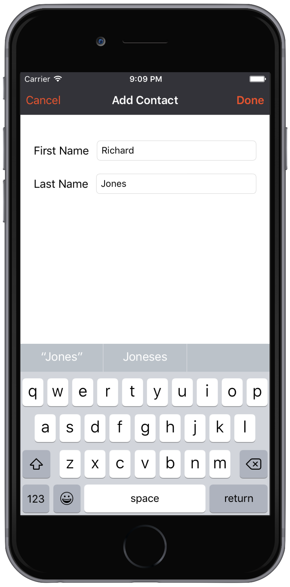
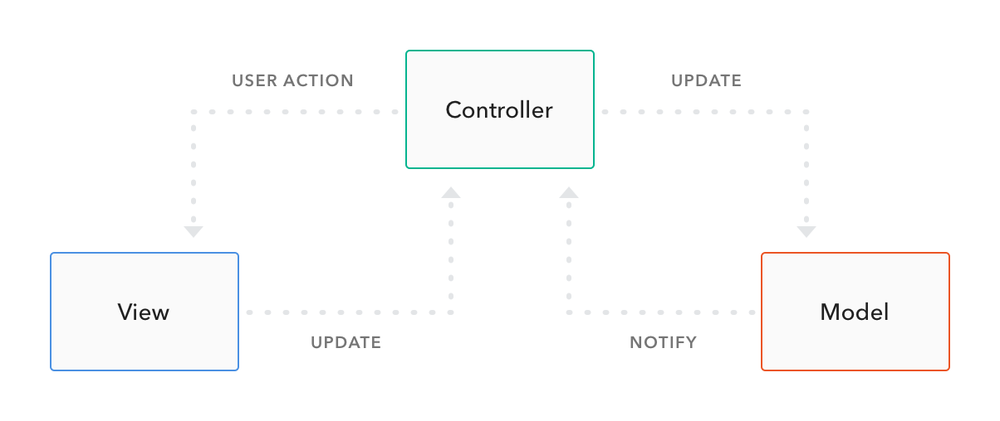
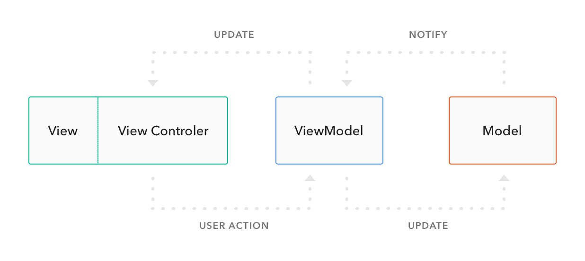
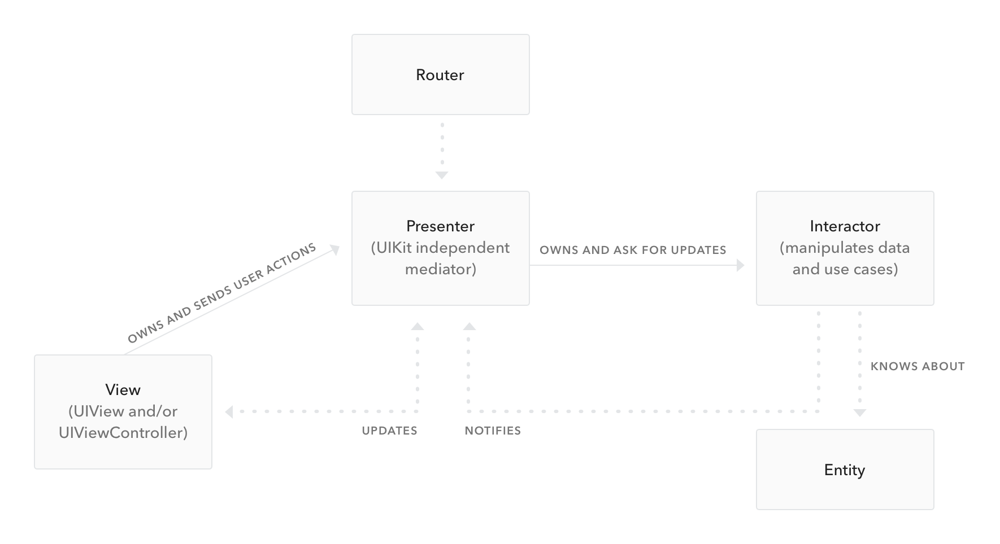

---

**TL;DR**: A well designed architecture is important to keep a project maintainable in the long term. In this article, we'll compare MVVM and VIPER for iOS projects as an alternative to the traditional MVC.

---

[MVC](https://en.wikipedia.org/wiki/Model–view–controller) is a well-known concept for those who have been developing software for a reasonable length of time. It's an acronym for **Model View Controller**, meaning that your project will be structured in 3 parts: _Model_, representing the entities; _View_, representing the interface with which the user interacts; and _Controller_, responsible for connecting the other two pieces. That's how Apple recomends us to organize our iOS projects - which means that everything that is not a View or Model is part of the Controller layer.

However, you problably know that projects can be highly complex: handling network requests, parsing responses, accessing data models, formatting data for the interface, responding to interface events, and so on. You'll end up with enormous Controllers, responsible for all these different things and not reusable at all. In other words, MVC is a nightmare for developers in charge of the maintenance of a project. But how can we accomplish a better separation of concerns and reusability for iOS projects?

We'll explore two popular alternatives for MVC: MVVM and VIPER. Both are gaining popularity in the iOS community, and proved to be good ways to go instead of the traditional MVC (gently nicknamed as [Massive View Controller](https://twitter.com/Colin_Campbell/status/293167951132098560)). We'll talk about how these two different architectures are structured, build an example application and compare when it's the case to use one or the other.

### Example

We'll build a Contacts app. You can follow the example in [this repository](https://github.com/auth0-tutorials/mvvm_viper/). The starter folders, for both MVVM and VIPER sections, contain the initial setup and only need the code from the tutorial to work.

The app has two screens: the first is a list of contacts, displayed in table view with their full name and a placeholder profile image.



The second is an Add Contact screen, with first/last name text fields and cancel/done button items.



## MVVM

### How it works

MVVM stands for **Model-View-ViewModel**. It's a different way to arrange responsibilities, changing a few roles compared to MVC.

- **Model** - This is the layer that does not change if compared to MVC. It still represents the data-model layer of your application, and can hold business logic responsibilities as well. You may also want to create a manager class to manipulate the model objects and a network manager class to handle requests and data parsing.

- **View** - Here things start to change. The _View_ layer in MVVM englobes the interface (UIView subclasses, xib and storyboard files), the view logic (animations, drawing) and handling user input events (button clicks, transitions, etc). Those are responsibilities of the _View_ and the _Controller_ in the MVC. This means that your views will remain the same, while your controllers will only contain a small subset of the responsibilities they have in MVC - and will get reasonably smaller than usual

- **ViewModel** - That's the new home for most of your usual Controller code. _ViewModel_ will request the data from the model layer (it might be a local access to a database or a network request) and pass it back to the view, formatted in the way it will be displayed. But it's a two-way mechanism: user input, when necessary, will also get through the ViewModel to update the Model. Since the ViewModel controls exactly what is being displayed, it's useful to use some data binding mechanism between the two layers. 

Comparing to MVC, you change from a architecture that looks like this:



For something that looks like this:



In which the View layer corresponds to UIView and UIViewController classes and subclasses.

Now it's time to get hands dirty to grasp the new concepts. So let's build an example app structured using MVVM!

### MVVM Contacts App

#### Model <a id="model"></a>

The following code is a class to represent the contact and two operator overloading functions. Replace the content in **Contact.swift** file with the following code.

```swift
import Foundation
import CoreData

public class Contact: NSManagedObject {

    var fullName: String {
        get {
            var name = ""
            if let firstName = firstName {
                name += firstName
            }
            if let lastName = lastName {
                name += " \(lastName)"
            }
            return name
        }
    }
}

```
A Contact has only these two fields, _firstName_ and _lastName_. A stored property is responsible for returning the _fullName_, and the operators _>_ and _<_ have their implementation to be used when an instance is inserted in a ordered list.

#### View

There are three files responsible for the view layer: the **Main** storyboard, with views already laid out in the starter project; the **ContactsViewController**, that displays the contacts list in a table view; and the **AddContactViewController**, with two labels and fields for setting up the first and last name of a new contact. Let's start with the code for **ContactsViewController**. Replace the **ContactsViewController.swift** file with the following code.

```swift
import UIKit
import Foundation

class ContactsViewController: UIViewController {

    @IBOutlet var tableView: UITableView!
    let contactViewModelController = ContactViewModelController()

    override func viewDidLoad() {
        super.viewDidLoad()
        tableView.tableFooterView = UIView()
        contactViewModelController.retrieveContacts({ [unowned self] in
            self.tableView.reloadData()
        }, failure: nil)
    }

    override func prepareForSegue(segue: UIStoryboardSegue, sender: AnyObject?) {
        let addContactNavigationController = segue.destinationViewController as? UINavigationController
        let addContactVC = addContactNavigationController?.viewControllers[0] as? AddContactViewController

        addContactVC?.contactsViewModelController = contactViewModelController
        addContactVC?.didAddContact = { [unowned self] (contactViewModel, index) in
            let indexPath = NSIndexPath(forRow: index, inSection: 0)
            self.tableView.beginUpdates()
            self.tableView.insertRowsAtIndexPaths([indexPath], withRowAnimation: .Left)
            self.tableView.endUpdates()
        }
    }

}

extension ContactsViewController: UITableViewDataSource {

    func tableView(tableView: UITableView, cellForRowAtIndexPath indexPath: NSIndexPath) -> UITableViewCell {
        let cell = tableView.dequeueReusableCellWithIdentifier("ContactCell") as? ContactsTableViewCell
        guard let contactsCell = cell else {
            return UITableViewCell()
        }

        contactsCell.cellModel = contactViewModelController.viewModel(at: indexPath.row)
        return contactsCell
    }

    func tableView(tableView: UITableView, numberOfRowsInSection section: Int) -> Int {
        return contactViewModelController.contactsCount
    }

}

```

A quick look is enough to realize that this class has mostly interface responsibilities. It also has navigation flow dependency in __prepareForSegue(::)__ - something that will change in VIPER with the Router layer.

Now take a closer look at the class extension that conforms to the _UITableViewDataSource_ protocol. The implemented functions don't interact directly with the __Contact__ class in the Model layer - instead, it gets the data (represented by the __ViewModel__) the way it will be displayed, already formatted by the __ViewModelController__.

Same thing happens with the closure that is called when a contact is created. Its only work is to insert a new row in the table view - that's only an interface update!

Now it's necessary to guarantee the data binding between the _UITableViewCell_ subclass and the ViewModel. Replace the **ContactsTableViewCell.swift** file with the following code.

```swift
import Foundation
import UIKit

class ContactsTableViewCell: UITableViewCell {
    var cellModel: ContactViewModel? {
        didSet {
            bindViewModel()
        }
    }

    func bindViewModel() {
        textLabel?.text = cellModel?.fullName
    }
}

```

Now replace your **AddContactViewController.swift** file with the following code:

```swift
import Foundation
import UIKit

class AddContactViewController: UIViewController {

    @IBOutlet var firstNameTextField: UITextField!
    @IBOutlet var lastNameTextField: UITextField!
    var contactsViewModelController: ContactViewModelController?
    var didAddContact: ((ContactViewModel, Int) -> Void)?

    override func viewDidLoad() {
        super.viewDidLoad()
        firstNameTextField.becomeFirstResponder()
    }

    @IBAction func didClickOnDoneButton(sender: UIBarButtonItem) {
        guard let firstName = firstNameTextField.text,
            let lastName = lastNameTextField.text
            else {
                return
        }

        if firstName.isEmpty || lastName.isEmpty {
            showEmptyNameAlert()
            return
        }

        dismissViewControllerAnimated(true) { [unowned self] in
            self.contactsViewModelController?.createContact(firstName: firstName, lastName: lastName,
                                                            success: self.didAddContact, failure: nil)
        }

    }

    @IBAction func didClickOnCancelButton(sender: UIBarButtonItem) {
        dismissViewControllerAnimated(true, completion: nil)
    }

    private func showEmptyNameAlert() {
        showMessage(title: "Error", message: "A contact must have first and last names")
    }

    private func showMessage(title title: String, message: String) {
        let alertView = UIAlertController(title: title,
                                          message: message,
                                          preferredStyle: .Alert)
        alertView.addAction(UIAlertAction(title: "Ok", style: .Destructive, handler: nil))
        presentViewController(alertView, animated: true, completion: nil)
    }

}

```
Again, mostly UI operations. Note that it delegates to the __ViewModelController__ the responsibility of creating a new _Contact_ instance on _didClickOnDoneButton(:)_.

#### View Model

Time to talk about what's new: the View Model layer. First, insert the following code in the **ContactViewModel.swift** file.

```swift
import Foundation

public struct ContactViewModel {
    var fullName: String
}

public func <(lhs: ContactViewModel, rhs: ContactViewModel) -> Bool {
    return lhs.fullName.lowercaseString < rhs.fullName.lowercaseString
}

public func >(lhs: ContactViewModel, rhs: ContactViewModel) -> Bool {
    return lhs.fullName.lowercaseString > rhs.fullName.lowercaseString
}

```

And the following code in the **ContactViewModelController** file.

```swift
import Foundation

class ContactViewModelController {

    private var contactViewModelList: [ContactViewModel] = []
    private var dataManager = ContactLocalDataManager()

    var contactsCount: Int {
        return contactViewModelList.count
    }

    func retrieveContacts(success: (() -> Void)?, failure: (() -> Void)?) {
        do {
            let contacts = try dataManager.retrieveContactList()
            contactViewModelList = contacts.map() { ContactViewModel(fullName: $0.fullName) }
            success?()
        } catch {
            failure?()
        }
    }

    func viewModel(at index: Int) -> ContactViewModel {
        return contactViewModelList[index]
    }

    func createContact(firstName firstName: String, lastName: String,
                                 success: ((ContactViewModel, Int) -> Void)?,
                                 failure: (() -> Void)?) {
        do {
            let contact = try dataManager.createContact(firstName: firstName, lastName: lastName)
            let contactViewModel = ContactViewModel(fullName: contact.fullName)
            let insertionIndex = contactViewModelList.insertionIndex(of: contactViewModel) { $0 < $1 }
            contactViewModelList.insert(contactViewModel, atIndex: insertionIndex)
            success?(contactViewModel, insertionIndex)
        } catch {
            failure?()
        }
    }

}

```
> Note: MVVM is not clear about how ViewModels are created. For a more layered architecture, I prefer to create a ViewModelController, which is responsible for interacting with the Model layer and creating ViewModels.

First thing to remember as a rule of thumb: the View Model layers is not responsible for user interface. A way to guarantee that you're not messing things up is to **never** import UIKit in a View Model file.

The _ContactViewModelController_ class retrieves contacts from the local storage and tries to not expose the Model layer. It returns the data formatted in the way that the view asks, and notifies the view that there are changes in the data source when a new contact is added.

In a real world scenario, this would involve performing a network request besides inserting in a local database. But none of them should be a View Model role anyway - networking and database should have their own managers.

That's it for MVVM. You may find this approach more testable, mantainable and distributed than usual MVC. So let's talk about VIPER and check how the two compare.

## VIPER

### How it works

VIPER is an application of the [Clean Architecture](https://8thlight.com/blog/uncle-bob/2012/08/13/the-clean-architecture.html) to iOS projects. It stands for View, Interactor, Presenter, Entity, and Router. It's a really segmented way to divide responsibilities, fits very well with unit testing and makes your code more reusable. 



- **View** - It's the interface layer, which means UIKit files (including UIViewController). At this point, it's quite clear that UIViewController subclasses should belong to the View layer in a more decoupled architecture. In VIPER, things are basically the same of those in MVVM: views are responsible for displaying what the presenter asks them to, and to transmit user input back to the Presenter.

- **Interactor** - Contains the business logic that are described by the use cases in the application. The interactor is responsible for fetching data from the model layer (using network or local database), and its implementation is totally independent of the UI. It's important to remember that network and database managers are not part of VIPER, so they are treated as separated dependencies.

- **Presenter** - Contains view logic to format data to be displayed. In MVVM, this is part of the job done by the ViewModelController in our example. The Presenter receives data from the Interactor and carry it to the View. Also, it reacts to user inputs, asking for more data or sending it back to the Interactor.

- **Entity** - Has part of the responsibilities of the Model layer in the other architectures. Entities are plain data objects, with no business logic, managed by the Interactor.

- **Router** - The navigation logic of the application. It might not seem an important layer, but if you have to reuse the same iPhone views in a iPad, the only thing that might change is the way that the views are presented. This lets your other layers untouched, and the Router is responsible for the navigation flow in each situation.

Comparing to MVVM, Viper has a few key differences in the distribution of responsibilities:
- It introduces Router, the layer responsible for the navigation flow, removing it from the View.
- Entities are plain data structures, transferring the access logic that usually belongs to Model to the Interactor.
- ViewModelController responsibilities are shared among Interactor and Presenter.

Again, it's time to get the hands dirty and explore the VIPER architecture with an example app. For the sake of simplicity, we will explore only the Contact List module. The code for the Add Contact module can be found in the starter project (_VIPER Contacts Starter_ folder in [this repository](https://github.com/auth0-tutorials/mvvm_viper/)).

> Note: if you consider making your application based in VIPER, please do not create all files manually - you can check a VIPER code generator like [VIPER gen](https://github.com/pepibumur/viper-module-generator?utm_source=swifting.io) or [Generamba](https://github.com/rambler-ios/Generamba).

### Contacts App

#### View

The view is represented by the elements in the **Main.storyboard** file and the **ContactListView** class. It is passive; only passes interface events along to the presenter, and updates itself when notified by the presenter. Replace the content in **ContactListView.swift** with the following code.

```swift
import Foundation
import UIKit

class ContactListView: UIViewController {

    @IBOutlet var tableView: UITableView!
    var presenter: ContactListPresenterProtocol?
    var contactList: [ContactViewModel] = []

    override func viewDidLoad() {
        super.viewDidLoad()
        presenter?.viewDidLoad()

        tableView.tableFooterView = UIView()
    }

    @IBAction func didClickOnAddButton(sender: UIBarButtonItem) {
        presenter?.addNewContact(from: self)
    }

}

extension ContactListView: ContactListViewProtocol {

    func reloadInterface(with contacts: [ContactViewModel]) {
        contactList = contacts
        tableView.reloadData()
    }

    func didInsertContact(contact: ContactViewModel) {
        let insertionIndex = contactList.insertionIndex(of: contact) { $0 < $1 }
        contactList.insert(contact, atIndex: insertionIndex)

        let indexPath = NSIndexPath(forRow: insertionIndex, inSection: 0)
        tableView.beginUpdates()
        tableView.insertRowsAtIndexPaths([indexPath], withRowAnimation: .Right)
        tableView.endUpdates()
    }

}

extension ContactListView: UITableViewDataSource {

    func tableView(tableView: UITableView, cellForRowAtIndexPath indexPath: NSIndexPath) -> UITableViewCell {
        guard let cell = tableView.dequeueReusableCellWithIdentifier("ContactCell") else {
            return UITableViewCell()
        }
        cell.textLabel?.text = contactList[indexPath.row].fullName
        return cell
    }

    func tableView(tableView: UITableView, numberOfRowsInSection section: Int) -> Int {
        return contactList.count
    }

}

```

The view sends _viewDidLoad_ and _didClickOnAddButton_ events to the presenter. In the former, the presenter will ask the interactor for data; in the latter, the presenter will ask the route layer to present the Add Contact module.

Methods from _ContactListViewProtocol_ are called from the presenter, either when the contacts list is retrieved or when a new contact is added. In both situations, the data in the view only contains the information needed for display.

Finally, there are the implementations of the _UITableViewDataSource_ methods, updating the interface elements with the retrieved data.

#### Interactor

The interactor in our example is quite simple. It only asks the local data manager for data - it does not care if the local manager is using Core Data, [Realm](https://realm.io) or any other data storage solution. The following code is part of the **ContactListInteractor.swift** file:

```swift
import Foundation

class ContactListInteractor: ContactListInteractorInputProtocol {
    weak var presenter: ContactListInteractorOutputProtocol?
    var localDatamanager: ContactListLocalDataManagerInputProtocol?

    func retrieveContacts() {
        do {
            if let contactList = try localDatamanager?.retrieveContactList() {
                presenter?.didRetrieveContacts(contactList)
            } else {
                presenter?.didRetrieveContacts([])
            }

        } catch {
            presenter?.didRetrieveContacts([])
        }
    }

}

```
After retrieving data, the interactor notifies the presenter and sends what was retrieved. As an alternative for this implementation, the interactor can also [propagate the error](https://developer.apple.com/library/ios/documentation/Swift/Conceptual/Swift_Programming_Language/ErrorHandling.html#//apple_ref/doc/uid/TP40014097-CH42-ID508) to the presenter, which will then be responsible for formatting a error object to be displayed in the view.

> Note: as you may have noticed, each layer in VIPER is implementing a protocol. This way, classes depend on abstractions instead of concretions, conforming to the Dependency Inversion principle.

#### Presenter

This is the central point in the VIPER architecture. The communication between view and the other layers (interactor and and router) passes through the presenter. Let's see how things work by placing the following code in the **ContactListPresenter.swift** file.

```swift
import Foundation

class ContactListPresenter: ContactListPresenterProtocol {
    weak var view: ContactListViewProtocol?
    var interactor: ContactListInteractorInputProtocol?
    var wireFrame: ContactListWireFrameProtocol?
    
    func viewDidLoad() {
        interactor?.retrieveContacts()
    }
    
    func addNewContact(from view: ContactListViewProtocol) {
        wireFrame?.presentAddContactScreen(from: view)
    }
    
}

extension ContactListPresenter: ContactListInteractorOutputProtocol {
    
    func didRetrieveContacts(contacts: [Contact]) {
        view?.reloadInterface(with: contacts.map() {
            return ContactViewModel(fullName: $0.fullName)
            })
    }
    
}

extension ContactListPresenter: AddModuleDelegate {
    
    func didAddContact(contact: Contact) {
        let contactViewModel = ContactViewModel(fullName: contact.fullName)
        view?.didInsertContact(contactViewModel)
    }
    
    func didCancelAddContact() {}
    
}

```

When the view is loaded, it notifies the presenter, which asks the interactor for data. When the add button is clicked, it notifies the presenter, which asks the router layer to show the add contacts screen.

Also, when the contacts list is retrieved, the presenter formats the data and sends it back to the view. It is also responsible for implementing the Add Contact module delegate. This means that the presenter will be notified when a new contact is added, format it and send it to the view.

As you may have noticed, presenters might get large. When this happens, it is interesting to separate it in two modules: the presenter, which will only receives data and format it back to the view; and event handler, which will respond to interface events.

#### Entity

This layer is similar to the Model layer in MVVM. In our contacts app, it is represented by the **Contact** class and its operator overloading functions. Replace the **Contact.swift** file with the following code.

```swift
import Foundation
import CoreData

public class Contact: NSManagedObject {

    var fullName: String {
        get {
            var name = ""
            if let firstName = firstName {
                name += firstName
            }
            if let lastName = lastName {
                name += " " + lastName
            }
            return name
        }
    }

}

public struct ContactViewModel {
    var fullName = ""
}

public func <(lhs: ContactViewModel, rhs: ContactViewModel) -> Bool {
    return lhs.fullName.lowercaseString < rhs.fullName.lowercaseString
}

public func >(lhs: ContactViewModel, rhs: ContactViewModel) -> Bool {
    return lhs.fullName.lowercaseString > rhs.fullName.lowercaseString
}

```

The view model contains the fields that the presenter formats and view needs to display. The _Contact_ class is a subclass of _NSManagedObject_, containing the entity fields exactly as it is in the Core Data model.

#### Router

Last but not least, there is the router layer. The responsibility of navigating between modules is shared between the presenter and the wireframe. The presenter receives the user input and knows when to navigate, and the wireframe knows how to navigate. Replace the **ContactListWireFrame.swift** file with the following code.

```swift
import Foundation
import UIKit

class ContactListWireFrame: ContactListWireFrameProtocol {

    class func createContactListModule() -> UIViewController {
        let navController = mainStoryboard.instantiateViewControllerWithIdentifier("ContactsNavigationController")
        if let view = navController.childViewControllers.first as? ContactListView {
            let presenter: protocol<ContactListPresenterProtocol, ContactListInteractorOutputProtocol> = ContactListPresenter()
            let interactor: ContactListInteractorInputProtocol = ContactListInteractor()
            let localDataManager: ContactListLocalDataManagerInputProtocol = ContactListLocalDataManager()
            let wireFrame: ContactListWireFrameProtocol = ContactListWireFrame()

            view.presenter = presenter
            presenter.view = view
            presenter.wireFrame = wireFrame
            presenter.interactor = interactor
            interactor.presenter = presenter
            interactor.localDatamanager = localDataManager

            return navController
        }
        return UIViewController()
    }

    static var mainStoryboard: UIStoryboard {
        return UIStoryboard(name: "Main", bundle: NSBundle.mainBundle())
    }

    func presentAddContactScreen(from view: ContactListViewProtocol) {

        guard let delegate = view.presenter as? AddModuleDelegate else {
            return
        }

        let addContactsView = AddContactWireFrame.createAddContactModule(with: delegate)
        if let sourceView = view as? UIViewController {
            sourceView.presentViewController(addContactsView, animated: true, completion: nil)
        }
    }

}

```

Since the wireframe is responsible for creating a module, it is convenient to set all the dependencies here. When presenting another module, the wireframe receives the object which will present it, and asks another wireframe for the presented module. It also passes the required data for the created module (in this case, only a delegate to receive the added contact).

The router layer brings a good opportunity to [avoid using storyboards segues](https://www.toptal.com/ios/ios-user-interfaces-storyboards-vs-nibs-vs-custom-code) and deal with view controller transitions on code. Since storyboards don't offer a decent solution for passing data between view controllers, this doesn't always mean more code. All we get is more reusability, better separation of concerns and maintanability of a project.

## Conclusion

You can find all projects (VIPER and MVVM - Starter and Final) in [this repository](https://github.com/auth0-tutorials/mvvm_viper/).

As you can see, MVVM and VIPER might be different, but are not necessarily exclusive. MVVM only says that, besides View and Model, there should be a ViewModel layer. But it doesn't say how this ViewModel is created, nor how the data is retrieved - not all responsibilities are clearly defined. It's open and can be implemented in many different ways.

On the other hand, VIPER is a very specific software architecture. It contains layers carrying their own responsibilities and is less open to change. As we saw in this example, VIPER can also use view models, which are created by its presentation layer.

When it comes to choose one or the other, there's no silver bullet - but certainly a few advices. If you are in a long-term project with well defined requirements and intend to reuse components, then VIPER is definitely a better option. Its clear separation of concerns improves testability and reusability.

But if you are prototyping or in a shorter project with no need to reuse components, MVVM is a better fit. With VIPER, you might need to create a lot of classes and protocols for small responsibilities (think of a "About Us" screen). MVVM generally produces much less code due to its _not-so-clear_ separation of concerns and can avoid a lot of overhead created by VIPER. Your code will definitely be easier to write, and still easy to test and maintain.